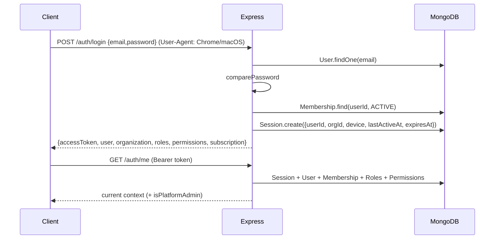

# DevSphere — Full Codebase Documentation

> A multi-tenant developer-collaboration platform. Organizations own repositories and
> "architecture" diagrams; members collaborate through roles/permissions; a subscription
> plan gates premium features and a separate platform-admin surface manages tenants.
> This document describes the entire codebase as it exists today: backend, frontend,
> data models, API surface, end-to-end flows, configuration, Docker deployment, and
> known gaps.

---

## Table of contents

1. [High-level overview](#1-high-level-overview)
2. [Repository layout](#2-repository-layout)
3. [Tech stack](#3-tech-stack)
4. [Getting started](#4-getting-started)
5. [Backend architecture](#5-backend-architecture)
6. [Backend API reference](#6-backend-api-reference)
7. [Data models (MongoDB)](#7-data-models-mongodb)
8. [Auth, sessions & RBAC](#8-auth-sessions--rbac)
9. [Billing & entitlements](#9-billing--entitlements)
10. [Platform administration](#10-platform-administration)
11. [Frontend architecture](#11-frontend-architecture)
12. [Frontend routes & feature areas](#12-frontend-routes--feature-areas)
13. [End-to-end flows](#13-end-to-end-flows)
14. [Configuration reference](#14-configuration-reference)
15. [Build, scripts & quality tooling](#15-build-scripts--quality-tooling)
16. [Known issues, gaps & inconsistencies](#16-known-issues-gaps--inconsistencies)
17. [Glossary & conventions](#17-glossary--conventions)

---

## 1. High-level overview

DevSphere is split into two independent applications that communicate over HTTP/JSON:

```
┌──────────────────────────┐        HTTPS/JSON        ┌───────────────────────────┐
│  frontend (SPA)          │  ───────────────────▶    │  backend (REST API)       │
│  React 19 + Vite         │  Bearer <accessToken>    │  Express 5 + TypeScript   │
│  localhost:5173 (Docker) │  ◀───────────────────    │  localhost:5002 (Docker)  │
│  Zustand store, axios    │                          │  Mongoose → MongoDB       │
└──────────────────────────┘                          └───────────────────────────┘
```

Core domain concepts:

- **User** — a person with credentials and OAuth links. There is **no** platform role on
  `User`; platform admins are a separate collection (see below).
- **Organization** — the tenant/workspace. Every signup provisions a personal workspace.
- **Membership** — links a `User` to an `Organization` with one or more **Roles** and a status.
- **Role / Permission** — RBAC. Seeded roles: `OWNER`, `MANAGER`, `DEVELOPER` over 22 permissions.
- **Subscription** — per-organization plan (`FREE` | `PREMIUM`) that unlocks **features**.
- **Session** — a server-side login session; a JWT references it and is rejected if the session
  is gone/expired. A session records the **device** it was created from (browser/OS/form factor)
  and a **lastActiveAt** stamp so the UI can show where and for how long a user is signed in.
- **Repository** — a GitHub repo connected to an org (mirror of metadata; code is read on
  demand from the GitHub API through an encrypted, user-scoped access token).
- **Architecture** — an org-owned Excalidraw document persisted to MongoDB.
- **Invitation** — a hashed, time-limited token to add a member to an organization.
- **PlatformAdmin** — a separate collection linking a `User` to a platform role
  (`SUPER_ADMIN` | `SUPPORT_ADMIN`); drives the `/api/admin` surface.
- **AuditLog** — present in the backend but not yet called anywhere.

The frontend is **fully wired to the backend** for auth, organizations, members, invitations,
billing, sessions/profile/password, platform admin, OAuth, repositories (GitHub), architecture
(Excalidraw), and the dashboard. Only a handful of nav surfaces are still static placeholders
(Projects, Agent, Code, Deployments, Meetings, Decisions).

The whole stack is containerized: `backend/Dockerfile`, `frontend/Dockerfile` (nginx-hosted
SPA), and a root `docker-compose.yml` that runs the API, the SPA, and a one-shot seeder —
all against **MongoDB Atlas** (the URI comes from `backend/.env`; no local MongoDB).

---

## 2. Repository layout

```
newdev/
├── docker-compose.yml            # seed + backend + frontend (MongoDB Atlas via backend/.env)
├── documentation.md
├── backend/                      # Express + Mongoose API
│   ├── .env                      # real secrets (Atlas URI, JWT secret, OAuth, admin creds)
│   ├── .env.example              # documented template
│   ├── Dockerfile                # node:22-alpine, multi-stage; keep tsx so seed runs
│   ├── .dockerignore
│   ├── package.json
│   ├── tsconfig.json
│   ├── dist/                     # compiled JS output (present)
│   └── src/
│       ├── server.ts             # entrypoint: connect DB, listen
│       ├── app.ts                # express app + route mounting
│       ├── config/
│       │   ├── env.ts            # Zod-validated environment
│       │   └── database.ts       # mongoose connect
│       ├── core/
│       │   ├── errors/AppError.ts
│       │   ├── http/response.ts    # sendSuccess / sendMessage
│       │   ├── security/
│       │   │   ├── jwt.ts          # sign/verifyAccessToken + AuthTokenPayload
│       │   │   ├── password.ts     # hashPassword / comparePassword
│       │   │   ├── session-expiration.ts
│       │   │   ├── token.ts        # generateSecureToken / hashToken
│       │   │   ├── encryption.ts   # AES-256-GCM encrypt/decrypt (provider tokens at rest)
│       │   │   └── device.ts       # parse User-Agent → { browser, os, deviceType }
│       │   └── middleware/
│       │       ├── auth.middleware.ts
│       │       ├── authorization.middleware.ts
│       │       ├── entitlement.middleware.ts
│       │       ├── platform.middleware.ts
│       │       ├── error.middleware.ts
│       │       └── rate-limit.middleware.ts
│       ├── modules/
│       │   ├── auth/              # login/signup/session/switch-org/OAuth
│       │   ├── organizations/     # org profile, members, roles
│       │   ├── invitations/       # create + accept invitations
│       │   ├── rbac/              # Permission, Role, access helper, seeding
│       │   ├── sessions/          # Session model (device + lastActiveAt)
│       │   ├── users/             # User model
│       │   ├── memberships/       # Membership model
│       │   ├── billing/           # plans, subscriptions, entitlement check
│       │   ├── platform/          # PlatformAdmin model + admin routes
│       │   ├── audit/             # AuditLog model + createAuditLog (unused)
│       │   ├── repositories/      # connect/list/tree/contents/branches via GitHub API
│       │   ├── architectures/     # CRUD + persisted Excalidraw documents
│       │   ├── dashboard/         # per-org overview stats
│       │   ├── agent/             # EMPTY DIR
│       │   ├── decisions/         # EMPTY DIR
│       │   ├── meetings/          # EMPTY DIR
│       │   └── projects/          # EMPTY DIR
│       └── scripts/
│           ├── seed.ts            # seed RBAC roles/permissions + FREE/PREMIUM plans
│           └── create-platform-admin.ts
└── frontend/                      # React SPA
    ├── .env                       # VITE_API_URL (no .env.example checked in)
    ├── Dockerfile                 # node build stage → nginx:alpine
    ├── nginx.conf                 # SPA fallback + asset caching + gzip
    ├── .dockerignore
    ├── package.json
    ├── vite.config.ts
    ├── tsconfig.json / tsconfig.app.json / tsconfig.node.json
    ├── eslint.config.js
    ├── .prettierrc
    ├── components.json            # shadcn config (style: base-nova)
    ├── index.html
    ├── public/
    └── src/
        ├── main.tsx               # providers + AppearanceSync + mount
        ├── App.tsx                # routing
        ├── index.css              # Tailwind v4 theme tokens + .reduce-motion
        ├── api/                   # repositories.ts, architectures.ts, dashboard.ts
        ├── components/
        │   ├── auth/              # guards, AuthLayout, OAuth buttons, AuthInitializer
        │   ├── dashboard/         # shell, sidebar, header, profile
        │   ├── architecture/      # list + Excalidraw editor (real API)
        │   ├── repositories/      # list/detail/code viewer (real API)
        │   ├── settings/          # 9 settings sections + sections metadata
        │   ├── landing/           # Navbar, Hero, Features, Workflow, Platform, CTA, Footer
        │   ├── icons/             # GithubIcon (lucide has no Github export)
        │   ├── AppearanceSync.tsx # applies .reduce-motion to <html>
        │   └── ui/                # shadcn/base-ui primitives
        ├── hooks/                 # use-mobile, use-permissions
        ├── layouts/               # DashboardLayout, AdminLayout
        ├── lib/                   # api, api-client, repository-tree, oauth, format, permissions
        ├── pages/                 # route pages (+ pages/admin/*)
        ├── store/                 # auth.store.ts, appearance.store.ts (persisted)
        └── types/                 # frontend TS types
```

---

## 3. Tech stack

### Backend

| Concern          | Choice |
|------------------|--------|
| Runtime          | Node.js 22 (Docker), CommonJS (`"type": "commonjs"`) |
| Language         | TypeScript `^7.0.2`, `strict`, `noUncheckedIndexedAccess`, `exactOptionalPropertyTypes` |
| HTTP framework   | Express `^5.2.1` |
| Database         | MongoDB via Mongoose `^9.10.1` |
| Validation       | Zod `^4.6.5` |
| Auth             | `jsonwebtoken` `^9.0.3`, `bcryptjs` `^3.0.3` |
| Security         | `helmet` `^8.3.0`, `cors` `^2.8.6`, `express-rate-limit` `^8.7.0`, AES-256-GCM (`node:crypto`) |
| Env              | `dotenv` `^17.4.2` |
| Module resolution| NodeNext (`"type"` is CommonJS; relative imports are extensionless) |
| GitHub API       | direct HTTPS calls with an encrypted per-user access token (no SDK) |
| Dev runner       | `tsx watch` |

### Frontend

| Concern          | Choice |
|------------------|--------|
| Build            | Vite `^8`, `@vitejs/plugin-react` `^6` |
| UI               | React `^19.2.8`, `react-dom` `^19.2.8` |
| Routing          | `react-router-dom` `^7.18.4` |
| State            | Zustand `^5.0.15` (auth + persisted appearance store) |
| HTTP             | axios `^1.20.0` |
| Styling          | Tailwind CSS `^4` via `@tailwindcss/vite`, `tw-animate-css` |
| Components       | shadcn CLI `^4.21.0` with **Base UI** primitives (`@base-ui/react` `^1.8.0`), style `base-nova` |
| Icons            | `lucide-react` `^1.46.0` |
| Diagrams         | `@excalidraw/excalidraw` `^0.18.1` |
| Theme            | custom `ThemeProvider` (light/dark/system) + `appearance.store` (compact sidebar, reduce motion) |
| Fonts            | Geist Variable (`@fontsource-variable/geist`) |

> **Important:** this project's shadcn components are built on **Base UI**, not Radix.
> Base UI primitives use a `render` prop for composition, **not** `asChild`.

---

## 4. Getting started

### Prerequisites

- Node.js 20+ (or Docker for the containerized path).
- A MongoDB database (`.env.example` defaults to `mongodb://localhost:27017/devsphere`;
  the committed `.env` points at MongoDB Atlas).

### 4.1 Backend, local development

```bash
cd backend
npm install
cp .env.example .env      # if .env is missing, then fill values
npm run seed              # REQUIRED: creates permissions, roles, plans
npm run dev               # http://localhost:5002 (env default is 5000; .env uses 5002)
```

`npm run seed` is mandatory before signup/login works: `signup` looks up the seeded
`FREE` plan and `OWNER` role by name and throws `500` if they do not exist. In Docker the
seed runs automatically (see §4.4).

### 4.2 Frontend, local development

```bash
cd frontend
npm install
# .env → VITE_API_URL=http://localhost:5002/api
npm run dev               # http://localhost:5173
```

### 4.3 Optional: platform admin

```bash
cd backend
npm run create:platform-admin   # reads PLATFORM_ADMIN_* from .env
```

Platform admins authenticate through the normal login flow, which requires an active
organization membership; the script provisions a personal workspace if the user has none.

### 4.4 Docker deployment

A root `docker-compose.yml` builds three pieces: a one-shot `seed` job (runs `npm run seed`,
idempotent), the backend API, and the frontend SPA (served by nginx). **There is no local
MongoDB service** — the backend and seeder connect to **MongoDB Atlas** using
`MONGODB_URI` from `backend/.env`.

```bash
# from the repo root
# make sure backend/.env has a valid Atlas MONGODB_URI first
docker compose up -d --build
# backend  → http://localhost:5002  (health: GET /api/health)
# frontend → http://localhost:5173
```

- `backend/.env` is required and is the single source of truth for connection settings
  (`MONGODB_URI`, `JWT_SECRET`, `TOKEN_ENCRYPTION_KEY`, OAuth credentials, ports). Compose only
  pins `NODE_ENV` and `PORT` on top of it.
- The frontend resolves the API URL **at runtime** — it is **not** baked into the image. At
  container start, `docker-entrypoint.d/30-inject-api-url.sh` renders `/usr/share/nginx/html
  /config.js` from the `VITE_API_URL` env var (default `http://localhost:5002/api`), and the SPA
  reads `window.__DEVSPHERE_API_URL__` set by that file (falling back to any build-time
  `import.meta.env.VITE_API_URL`, then localhost). Change the API URL by setting `VITE_API_URL`
  on the container — no rebuild needed.
- Host port mapping is overridable so you can run the stack without clashing with local dev
  servers: `DEVSPHERE_BACKEND_PORT` (default 5002) and `DEVSPHERE_FRONTEND_PORT` (default 5173).
- The backend image keeps the `src/` tree and dev dependencies so `seed`/`create:platform-admin`
  can run from the same image.
- Seed runs before the backend starts (`service_completed_successfully`), so RBAC/permissions
  and plans are guaranteed present before the API accepts traffic.

Verified images: `backend/Dockerfile` and `frontend/Dockerfile` build clean; in testing the
stack seeded and ran signup/login with device capture against Atlas.

> If you change nginx or compose config, rebuild with `docker compose build` before `up`.

### 4.5 Docker Hub & Render deployment

Images (multi-arch `linux/amd64` + `linux/arm64`) are published as
`kartikcdhry/devsphere-backend` and `kartikcdhry/devsphere-frontend` with `latest` and
versioned tags. Push flow (after `docker login`):

```bash
# backend
docker buildx build --platform linux/amd64,linux/arm64 --push \
  -t kartikcdhry/devsphere-backend:latest -t kartikcdhry/devsphere-backend:1.0.0 ./backend

# frontend — the API URL is injected at runtime from the container's VITE_API_URL
# env var (see §4.4); set it on the host/Render service, there is no build-time URL.
docker buildx build --platform linux/amd64,linux/arm64 --push \
  -t kartikcdhry/devsphere-frontend:latest -t kartikcdhry/devsphere-frontend:1.0.0 ./frontend
```

Render setup (dashboard): create two **Web Services** with Docker image deploy:

| Service        | Image                                | Runtime | Port | Health check path |
|----------------|--------------------------------------|---------|------|-------------------|
| API            | `kartikcdhry/devsphere-backend`      | Standard | use Render's value   | `/api/health` |
| Web (SPA)      | `kartikcdhry/devsphere-frontend`     | Free/Starter | 0   | `/` |

Web (SPA) service env vars (set in the Render dashboard):

```ini
VITE_API_URL=https://<your-backend>.onrender.com/api
```

For the API service:

```ini
NODE_ENV=production
PORT=<Render injects it — do not override>
MONGODB_URI=mongodb+srv://<atlas-user>:<atlas-pass>@<cluster>/devsphere
FRONTEND_URL=https://<your-frontend>.onrender.com
BACKEND_URL=https://<your-backend>.onrender.com
JWT_SECRET=<same long random string as local>
TOKEN_ENCRYPTION_KEY=<32-byte key; same as local so existing tokens stay valid>
# Google / GitHub OAuth — same client IDs as local, with redirect URIs updated to
# https://<your-backend>.onrender.com/api/auth/oauth/{google|github}/callback
```

One-time initial data (roles/permissions/plans): open the API service's **Shell** and run
`npm run seed` once (the image keeps `src/` + devDeps for this). Signup before seeding fails,
same as local development.

> The SPA reads its API URL from `/config.js`, which the frontend container renders at startup
> from its `VITE_API_URL` env var. Point that env var at your Render backend URL
> (`https://<your-backend>.onrender.com/api`); if you change the backend URL later, just edit the
> env var and redeploy — **no image rebuild required**.

---

## 5. Backend architecture

### 5.1 Layered structure

Every feature module follows the same shape:

```
routes  →  controller  →  service  →  model
                 │
                 └── validation (Zod) + types
```

- **routes** — bind HTTP method + path to middleware + controller.
- **controller** — reads `req`, calls service, sends response via `sendSuccess`/`sendMessage`.
- **service** — business logic; throws `AppError` for expected failures; talks to Mongoose.
- **model** — Mongoose schema.
- **validation** — Zod schemas; parsed inline in controllers.
- **types** — TypeScript interfaces/DTOs.

### 5.2 Entry point and request lifecycle

`server.ts` → `connectDatabase()` → `app.listen(PORT)`. Startup aborts if the DB connection
fails. **RBAC is not warmed at startup** — it is seeded separately by `npm run seed`
(`seedRBAC()` + `seedBilling()`).

`app.ts` middleware order and mounts:

```
helmet()
cors({ origin: FRONTEND_URL, credentials: true })
express.json({ limit: "10mb" })
GET /api/health                       → { success, message: "DevSphere API is running" }
/api/auth                             auth.routes
/api/invitations                      invitation.routes
/api/organizations                    organization.routes
/api/billing                          billing.routes
/api/admin                            platform-admin.routes
/api/repositories                     repository.routes
/api/architectures                    architecture.routes
/api/dashboard                        dashboard.routes
errorMiddleware                       (last)
```

Unmatched routes fall through to Express's default 404 (no explicit not-found handler).

### 5.3 Response envelope

| Helper | Shape |
|--------|-------|
| `sendSuccess(res, data, status=200)` | `{ success: true, data }` |
| `sendMessage(res, message, status=200)` | `{ success: true, message }` |
| `AppError` (via error middleware) | `{ success: false, message }` (its `statusCode`) |
| Zod error | `{ success: false, message: "Validation failed", errors: [{ field, message }] }` (400) |
| Unexpected error | `{ success: false, message: "Internal server error" }` (500) |

The error middleware does **not** translate Mongoose duplicate-key (`11000`) errors; services
handle expected conflicts explicitly (e.g. duplicate email → `409`).

### 5.4 Core middleware

**`authenticate`** (`auth.middleware.ts`)

1. Require `Authorization: Bearer <token>` (else `401`).
2. `verifyAccessToken(token)` → `{ userId, sessionId, organizationId }`.
3. Validate `userId` and `sessionId` are Mongo ObjectIds; look up `Session` by
   `_id + userId + organizationId`.
4. If session missing → `401 "Session expired or revoked"`.
5. If `session.expiresAt < now` → `401 "Session expired"`.
6. Load `User`; reject if missing (`401`) or `status !== "ACTIVE"` (`403`).
7. Load `Membership` (`userId + organizationId + status: "ACTIVE"`); reject if missing (`403`).
8. Load the membership's `Role`s and their `Permission`s, flattening permission names.
9. Attach **only** `req.auth = { userId, sessionId, organizationId, roles, permissions }`.

**`requireRole(roleName)`** — checks `req.auth.roles` contains the name; else `403`.

**`requirePermission(permission)`** — checks `req.auth.permissions` contains the name; else `403`.

**`requirePlatformAdmin`** (`platform.middleware.ts`) — looks up
`PlatformAdminModel.findOne({ userId: req.auth.userId, isActive: true })`; else `403`.

**`requireEntitlement(feature)`** (`entitlement.middleware.ts`) — loads the org's
`Subscription` with status in `ACTIVE`/`TRIALING`, then its `Plan`; requires
`plan.features` to include the feature; else `403`. Not applied to any route yet.

**`authRateLimiter`** (`rate-limit.middleware.ts`) — window 15 min, limit 20, applied to
`/auth/login` and `/auth/signup`.

### 5.5 Backend config

**`config/env.ts`** — Zod-parsed `process.env` (crashes on invalid):

| Var | Rule | Default |
|-----|------|---------|
| `PORT` | coerce integer | `5000` (`.env` uses **5002**) |
| `MONGODB_URI` | required, non-empty | — |
| `FRONTEND_URL` | URL | `http://localhost:5173` |
| `BACKEND_URL` | URL | `http://localhost:5002` |
| `JWT_SECRET` | required, min 32 chars | — |
| `JWT_EXPIRES_IN` | string | `7d` |
| `TOKEN_ENCRYPTION_KEY` | optional, min 32 chars | falls back to `JWT_SECRET` |
| `GOOGLE_CLIENT_ID` / `GOOGLE_CLIENT_SECRET` | optional | — |
| `GITHUB_CLIENT_ID` / `GITHUB_CLIENT_SECRET` | optional | — |

`TOKEN_ENCRYPTION_KEY` is used by `core/security/encryption.ts` (AES-256-GCM, random 12-byte IV
prepended to ciphertext). It encrypts the GitHub access token stored alongside OAuth
credentials; when unset it falls back to `JWT_SECRET`.

**`config/database.ts`** — `mongoose.connect(MONGODB_URI)`, logs host/name, exits process on failure.

**`core/security/jwt.ts`** — HS256 sign/verify.
`AuthTokenPayload = { userId, sessionId, organizationId }`.

**`core/security/session-expiration.ts`** — parses `JWT_EXPIRES_IN` (`\d+[smhd]`) into an
absolute `expiresAt` Date for new sessions.

**`core/security/device.ts`** — `getDeviceInfo(userAgent)` → `{ browser, os, deviceType }`
(`desktop | mobile | tablet`), a best-effort regex parse of the User-Agent. Every session
creating/refreshing auth action (signup, login, OAuth, switch-organization) passes this to the
service so sessions record which device created them.

---

## 6. Backend API reference

Base URL: `http://localhost:5002/api`.

Legend: 🔓 public · 🔒 authenticated · 🛡 permission/role required · 👑 platform admin.

| # | Method & path | Access | Purpose |
|---|---------------|--------|---------|
| 1 | `GET /health` | 🔓 | Liveness: `{ success, message: "DevSphere API is running" }` |
| 2 | `POST /auth/signup` | 🔓 (rate-limited) | Create user + personal org + session |
| 3 | `POST /auth/login` | 🔓 (rate-limited) | Authenticate, create session |
| 4 | `GET /auth/oauth/providers` | 🔓 | `{ google, github }` configured flags |
| 5 | `GET /auth/oauth/google` / `/callback` | 🔓 | Google OAuth redirect + callback |
| 6 | `GET /auth/oauth/github` / `/callback` | 🔓 | GitHub OAuth redirect + callback |
| 7 | `POST /auth/logout` | 🔒 | Delete current session |
| 8 | `POST /auth/logout-all` | 🔒 | Delete every session for the user |
| 9 | `GET /auth/me` | 🔒 | Current user + org context + subscription + admin flag |
| 10 | `PATCH /auth/me` | 🔒 | Update profile (`name` / `avatar`) |
| 11 | `PATCH /auth/password` | 🔒 | Change password |
| 12 | `GET /auth/sessions` | 🔒 | List the user's active sessions (device + activity) |
| 13 | `DELETE /auth/sessions/:sessionId` | 🔒 | Revoke one session |
| 14 | `POST /auth/switch-organization` | 🔒 | Re-issue session for another org |
| 15 | `POST /invitations` | 🛡 `member:invite` | Create invitation (returns raw token) |
| 16 | `POST /invitations/accept` | 🔒 | Accept invitation by token |
| 17 | `GET /organizations/mine` | 🔒 | List orgs the user belongs to |
| 18 | `GET /organizations/current` | 🔒 | Current org profile + member count + subscription |
| 19 | `PATCH /organizations/current` | 🛡 `requireRole("OWNER")` | Update org name |
| 20 | `GET /organizations/members` | 🛡 `member:read` | List members |
| 21 | `GET /organizations/roles` | 🛡 `member:invite` | List assignable roles |
| 22 | `GET /billing/subscription` | 🔒 | Current subscription + plan |
| 23 | `GET /repositories` | 🛡 `repository:read` | Connected repos for the current org |
| 24 | `GET /repositories/available` | 🛡 `repository:read` | User's GitHub repos (requires GitHub connection) |
| 25 | `POST /repositories` | 🛡 `repository:create` | Connect a GitHub repo (`{ fullName }`) |
| 26 | `GET /repositories/:repositoryId` | 🛡 `repository:read` | One connected repo |
| 27 | `DELETE /repositories/:repositoryId` | 🛡 `repository:delete` | Disconnect a repo |
| 28 | `GET /repositories/:repositoryId/tree?ref=` | 🛡 `repository:read` | Git tree (recursive) from GitHub |
| 29 | `GET /repositories/:repositoryId/contents?path=&ref=` | 🛡 `repository:read` | File content by path |
| 30 | `GET /repositories/:repositoryId/branches` | 🛡 `repository:read` | Branch list |
| 31 | `GET /architectures` | 🛡 `architecture:read` | Architecture docs for the org |
| 32 | `POST /architectures` | 🛡 `architecture:create` | Create a diagram document |
| 33 | `GET /architectures/:architectureId` | 🛡 `architecture:read` | One document |
| 34 | `PATCH /architectures/:architectureId` | 🛡 `architecture:update` | Update title/description/document |
| 35 | `DELETE /architectures/:architectureId` | 🛡 `architecture:delete` | Delete a document |
| 36 | `GET /dashboard` | 🔒 | Org overview stats + recent repos/architectures + subscription |
| 37 | `GET /admin/organizations` | 👑 | List all organizations |
| 38 | `PATCH /admin/organizations/:organizationId` | 👑 | Set org status (`ACTIVE`/`SUSPENDED`) |
| 39 | `GET /admin/users` | 👑 | List all users (providers, admin flags) |
| 40 | `PATCH /admin/users/:userId` | 👑 | Set user status (`ACTIVE`/`SUSPENDED`) |
| 41 | `GET /admin/stats` | 👑 | Rich platform statistics + recent records |

### 6.1 Auth endpoints — detail

**`POST /auth/signup`**
```jsonc
// request  (note: NO organizationName — signupSchema is { name, email, password })
{ "name": "Ada", "email": "ada@example.com", "password": "min8chars" }
// success 201 data
{
  "user": { "id", "name", "email", "avatar", "status", "emailVerified",
            "providers": { "google": false, "github": false }, "githubConnected": false },
  "organization": { "id", "name", "slug" },
  "organizations": [ { "id", "name", "slug", "roleIds": ["..."] } ],
  "roles": ["OWNER"],
  "permissions": ["...22 names..."],
  "subscription": { "id", "status", "startedAt", "expiresAt",
                    "plan": { "id", "code", "name", "description", "features" } },
  "accessToken": "<jwt>"
}
```
Creates: `User` (ACTIVE), `Organization` (`name` = `"<name>'s Workspace"`, unique slug),
`Subscription` (FREE, ACTIVE), `Membership` (OWNER, ACTIVE), `Session` (with the parsed
`device`). Duplicate email → `409`. Throws `500` if the FREE plan or OWNER role have not been
seeded.

**`POST /auth/login`**
```jsonc
{ "email": "ada@example.com", "password": "min8chars" }   // → same shape as signup
```
Rejects bad credentials (`401`), non-`ACTIVE` accounts (`403`), and users with no active
membership (`403`). Uses the **first** active membership as the active org. The created session
records device + activity.

**`GET /auth/me`** → the login/signup payload **plus** `isPlatformAdmin` and
`session: { id }` (no `accessToken`).

**`PATCH /auth/me`** body `{ name?, avatar? }` (at least one) → `{ user }`.

**`PATCH /auth/password`** body `{ currentPassword, newPassword }` → message. Rejects a wrong
current password or a new password equal to the current one (`400`).

**`GET /auth/sessions`** →
```jsonc
{ "sessions": [{
    "id", "isCurrent",
    "device": { "browser": "Chrome", "os": "macOS", "deviceType": "desktop" } | null,
    "startedAt", "lastActiveAt", "createdAt", "expiresAt",
    "organization": { "id", "name", "slug" } | null
  }] }
```
Sessions created before the `device` fields existed report `device: null`. `isCurrent` marks the
session referenced by the JWT used in the request.

**`DELETE /auth/sessions/:sessionId`** → message; `404` if not found. The current session is
linkable (frontend hides the revoke button, the backend does not special-case it).

**`POST /auth/switch-organization`** body `{ organizationId }`. Verifies membership, deletes
the current session, creates a new session for the target org (capturing the request's device),
returns the same context payload as login/signup (with `accessToken`).

**`POST /auth/logout`** deletes the session referenced by the JWT.
**`POST /auth/logout-all`** deletes all sessions for the user.

### 6.2 OAuth endpoints — detail

- `GET /auth/oauth/providers` → `{ google: bool, github: bool }` based on env config.
- `GET /auth/oauth/{google|github}` → redirects to the provider (or to
  `/login?error=...` if that provider is not configured). A signed `state` JWT (`10m`) is
  generated for CSRF protection.
- `GET /auth/oauth/{google|github}/callback` → verifies state, exchanges the code, then:
  - success → redirect `${FRONTEND_URL}/auth/callback?token=<accessToken>`
  - failure → redirect `${FRONTEND_URL}/login?error=<message>`

`loginWithOAuth` finds/creates the user by provider id or email, links the provider id,
fills the avatar, marks `emailVerified`, and provisions a workspace + FREE subscription +
OWNER membership on first login. It accepts the request's device and stamps the new session
with it. Callback URLs use `env.BACKEND_URL`.

GitHub OAuth requests `read:user user:email repo`; the returned access token (and scopes) are
stored **encrypted** on the `User` (see §5.5), enabling the repositories module to call the
GitHub API on the user's behalf with `repo` scope.

### 6.3 Invitations — detail

**`POST /invitations`** 🛡 `member:invite`
```jsonc
{ "email": "bob@example.com", "role": "MANAGER" }   // role enum: OWNER | MANAGER | DEVELOPER
// success 201 data
{ "invitationId": "...", "email": "bob@example.com", "role": "MANAGER",
  "expiresAt": "...", "token": "<raw token>" }
```
Generates a random token, stores only its **SHA-256 hash**, returns the **raw token**.
Blocks inviting an existing member and duplicate pending invites (both `409`), and rejects
an unknown role (`400`). Expiry is fixed at 7 days. No email is sent.

**`POST /invitations/accept`** 🔒 body `{ token }`
- Looks up by token hash + `status: "PENDING"`.
- Missing → `400`; expired → marks `EXPIRED` and throws `400`.
- The invitation email **must equal** the logged-in user's email (else `403`).
- Existing membership → `409`; otherwise creates an active `Membership` with the role.
- Marks the invitation `ACCEPTED` and sets `acceptedAt`.

### 6.4 Repositories — detail

All routes are behind `authenticate` + `requirePermission("repository:...")` and scope data to
the **current org** from the session.

- **`GET /repositories/available`** — calls GitHub `GET /user/repos` (per_page 100) using the
  user's stored token; returns repo stubs (`fullName`, owner, private, language, description).
- **`POST /repositories`** `{ fullName }` — looks the repo up on GitHub, persists a
  `Repository` document (org-scoped, unique on `{ organizationId, githubRepoId }`). Returns 201.
- **`GET /repositories/:repositoryId/tree?ref=`** — `GET /repos/{fullName}/git/trees/{ref}?recursive=1`
  to GitHub; returns a nested tree the frontend walks into a file tree.
- **`GET /repositories/:repositoryId/contents?path=&ref=`** — `GET /repos/{fullName}/contents/{path}?ref=`
  to GitHub; returns base64 content (+ language info where derivable).
- **`GET /repositories/:repositoryId/branches`** — GitHub branch list.
- **`DELETE /repositories/:repositoryId`** — removes the org's `Repository` document
  (does not delete the GitHub repo).

If the user has no GitHub connection, `available` returns `{ available: false }` (and the tree
/contents/branches calls fail with a clear error).

### 6.5 Architectures — detail

- **`GET /architectures`** — list for the org (sorted by `updatedAt` desc).
- **`POST /architectures`** `{ title, description?, repositoryId? }` — creates an empty
  Excalidraw document (default `{ elements: [], appState: {}, files: {} }`).
- **`GET /architectures/:architectureId`** — full document including the Excalidraw payload.
- **`PATCH /architectures/:architectureId`** `{ title?, description?, document? }` — updates;
  `document` is the saved Excalidraw scene (`elements`, `appState`, `files`).
- **`DELETE /architectures/:architectureId`** — removes the document.

### 6.6 Dashboard — detail

**`GET /dashboard`** (authenticate only) →
```jsonc
{ "stats": { "repositories", "privateRepositories", "architectures", "members" },
  "recentRepositories": [ ...4 repo DTOs ], "recentArchitectures": [ ...4 ],
  "subscription": { ... } | null }
```

### 6.7 Admin endpoints — detail

- **`GET /admin/users`** now returns, per user, `providers` (`EMAIL`/`GOOGLE`/`GITHUB`)
  derived from `passwordHash`/`googleId`/`githubId`, and `isPlatformAdmin` (membership in
  `PlatformAdminModel` with `isActive`).
- **`GET /admin/stats`** returns a nested, descriptive payload:
  ```jsonc
  { "organizations": { "total", "active", "suspended", "new30d" },
    "users":        { "total", "active", "suspended", "new30d" },
    "memberships":  { "active" },
    "subscriptions":{ "total", "premium", "free" },
    "recentOrganizations": [ { "id", "name", "status", "createdAt" } ],
    "recentUsers":  [ { "id", "name", "email", "status", "createdAt" } ] }
  ```

---

## 7. Data models (MongoDB)

### User — `modules/users/user.model.ts`
| Field | Type | Notes |
|-------|------|-------|
| `name` | String | required, trimmed, max 100 |
| `email` | String | required, unique, lowercase, trimmed, indexed |
| `passwordHash` | String | required (bcrypt) |
| `avatar` | String? | default `null` |
| `status` | `ACTIVE` \| `SUSPENDED` \| `PENDING` | default `ACTIVE` |
| `emailVerified` | Boolean | default `false` |
| `googleId` | String? | unique sparse |
| `githubId` | String? | unique sparse |
| `githubLogin` | String? | GitHub login name |
| `githubAccessToken` | String? | **encrypted** access token (AES-256-GCM via `TOKEN_ENCRYPTION_KEY`) |
| `githubTokenScopes` | String[]? | scopes granted at connect time |
| `githubConnectedAt` | Date? | when the token was stored |
| timestamps | | |

### Organization — `modules/organizations/organization.model.ts`
| Field | Type | Notes |
|-------|------|-------|
| `name` | String | required, trimmed, max 120 |
| `slug` | String | required, unique, lowercase, indexed |
| `createdBy` | ObjectId → User | required |
| `status` | `ACTIVE` \| `SUSPENDED` | default `ACTIVE` |
| timestamps | | |

### Membership — `modules/memberships/membership.model.ts`
| Field | Type | Notes |
|-------|------|-------|
| `userId` | ObjectId → User | required, indexed |
| `organizationId` | ObjectId → Organization | required, indexed |
| `roleIds` | ObjectId[] → Role | |
| `status` | `ACTIVE` \| `INVITED` \| `SUSPENDED` | default `ACTIVE` |
| timestamps | | unique compound `{ userId, organizationId }` |

### Role / Permission — `modules/rbac/*.model.ts`
- **Role**: `{ name: OWNER|MANAGER|DEVELOPER (unique, uppercase), description, permissions: ObjectId[], isSystemRole }`.
- **Permission**: `{ name (unique, lowercase), description, resource, action }` — the key field
  is `name` (e.g. `project:read`), plus a `{ resource, action }` index.

### Session — `modules/sessions/session.model.ts`
| Field | Type | Notes |
|-------|------|-------|
| `userId`, `organizationId` | ObjectId | required, indexed |
| `tokenVersion` | Number | default 0 (stored but not checked in `authenticate`) |
| `device` | `{ browser, os, deviceType }` sub-document | `_id: false`, default `null`; `deviceType` enum `desktop\|mobile\|tablet` |
| `lastActiveAt` | Date | default `null`, indexed; stamped at creation |
| `expiresAt` | Date | required, indexed, **TTL index** (`expireAfterSeconds: 0`) |
| timestamps | | |

### Repository — `modules/repositories/repository.model.ts`
| Field | Type | Notes |
|-------|------|-------|
| `organizationId` | ObjectId → Organization | required, indexed |
| `connectedBy` | ObjectId → User | required |
| `provider` | `GITHUB` | default `GITHUB` |
| `githubRepoId` | String | required |
| `name`, `fullName`, `owner` | String | required |
| `private` | Boolean | default `false` |
| `defaultBranch` | String | default `"main"` |
| `language`, `description`, `cloneUrl` | String? | default `null` |
| `htmlUrl` | String | required |
| `status` | `CONNECTED` \| `ERROR` | default `CONNECTED` |
| `lastSyncedAt` | Date? | default `null` |
| timestamps | | unique `{ organizationId, githubRepoId }` |

### Architecture — `modules/architectures/architecture.model.ts`
| Field | Type | Notes |
|-------|------|-------|
| `organizationId` | ObjectId → Organization | required, indexed |
| `repositoryId` | ObjectId → Repository? | default `null` |
| `title` | String | required, max 120 |
| `description` | String | default `""`, max 500 |
| `document` | Mixed | Excalidraw scene `{ elements[], appState, files }` |
| `createdBy` | ObjectId → User | required |
| timestamps | | index `{ organizationId, updatedAt: -1 }` |

### Subscription — `modules/billing/subscription.model.ts`
| Field | Type | Notes |
|-------|------|-------|
| `organizationId` | ObjectId → Organization | required, unique, indexed |
| `planId` | ObjectId → SubscriptionPlan | required |
| `status` | `ACTIVE` \| `CANCELED` \| `PAST_DUE` \| `TRIALING` | required |
| `startedAt` | Date | required |
| `expiresAt` | Date? | default `null` |
| timestamps | | |

### SubscriptionPlan — `modules/billing/plan.model.ts`
`{ code: FREE|PREMIUM (unique, uppercase), name, description, features: string[] }`.

### Invitation — `modules/invitations/invitation.model.ts`
`{ organizationId, email (lowercase, indexed), roleId → Role, invitedBy → User,
tokenHash (unique), status: PENDING|ACCEPTED|EXPIRED|REVOKED (default PENDING),
expiresAt (indexed), acceptedAt? }` plus a `{ organizationId, email, status }` index.

### AuditLog — `modules/audit/audit.model.ts`
`{ organizationId?, userId?, action (AuditAction, indexed), resource?, resourceId?,
metadata (Mixed), ipAddress?, userAgent?, createdAt }` — model + `createAuditLog` exist in
`audit.service.ts` but **no code calls them**.

### PlatformAdmin — `modules/platform/platform-admin.model.ts`
`{ userId → User (unique, indexed), role: SUPER_ADMIN|SUPPORT_ADMIN, isActive }`.
`requirePlatformAdmin` reads this collection directly (not a field on `User`).

### RBAC seed data (`modules/rbac/rbac.seed.ts`)
22 permissions across six groups:

- **projects**: `project:read`, `project:create`, `project:update`, `project:delete`
- **repositories**: `repository:read`, `repository:create`, `repository:update`, `repository:delete`
- **architecture**: `architecture:read`, `architecture:create`, `architecture:update`, `architecture:delete`
- **deployments**: `deployment:read`, `deployment:create`, `deployment:deploy`, `deployment:delete`
- **team**: `member:read`, `member:invite`, `member:update`, `member:remove`
- **agent**: `agent:read`, `agent:execute`

| Role | Permission count | Notes |
|------|------------------|-------|
| **OWNER** | all 22 | every permission |
| **MANAGER** | 17 | read/create/update on projects, repositories, architecture; `deployment:read/create/deploy`; `member:read/invite/update`; `agent:read/execute`. Excludes all four `*:delete` and `member:remove`. |
| **DEVELOPER** | 10 | `project:read`; `repository:read/create/update`; `architecture:read/create/update`; `deployment:read`; `agent:read/execute` |

Plans seeded (`modules/billing/billing.seed.ts`): `FREE` (projects, repositories,
architecture), `PREMIUM` (FREE + deployments, meetings, decisions, ai-agent).

---

## 8. Auth, sessions & RBAC

### Token & session model

- Login/signup returns a **JWT** containing `{ userId, sessionId, organizationId }`,
  signed HS256, expiring per `JWT_EXPIRES_IN`.
- The JWT alone is *not* sufficient: `authenticate` re-validates the **server-side Session**
  (existence + `expiresAt`) on every request. Deleting the session immediately revokes access.
- Frontend stores the token in `localStorage` under `devsphere_access_token`.

### Device capture

Every session-creating endpoint passes `getDeviceInfo(req.get("user-agent"))` into the auth
service. `createSession(userId, organizationId, device?)` stores `device` and `lastActiveAt`
(now) alongside `expiresAt`. `listSessions` returns `device`, `startedAt`, `lastActiveAt` so
the Security settings UI can render "Chrome · macOS · signed in 2h ago · last active 4m ago ·
expires in 3d". Sessions with no recorded device show "Unknown device".

### RBAC resolution

```
User ── Membership ── Role[] ── Permission[]
```

Permissions are flattened into a name array during `authenticate`; route guards read it.
The same logic is reused by `getRolesAndPermissions(roleIds)` (`rbac/access.ts`).

### Multi-tenancy

An organization is the tenant boundary. All auth-scoped data is keyed by `organizationId`
from the session/JWT. `switch-organization` issues a new session bound to another org.

### Flow diagram



---

## 9. Billing & entitlements

- **Plans** are seeded documents with a `features: string[]` array.
- **Subscriptions** link an org to a plan (unique per org).
- `getOrganizationSubscription(orgId)` returns the subscription with status in
  `ACTIVE`/`TRIALING` and its populated plan (or `null`), used by `/auth/me`,
  `/billing/subscription`, `/organizations/current`, `/dashboard`, and admin listings.
- `requireEntitlement(feature)` middleware is available to gate premium features but is
  **not applied to any route yet**.
- **Current limitation:** billing is read-only — there is no checkout, plan change, or
  cancellation endpoint. `/api/billing` exposes only `GET /subscription`.

---

## 10. Platform administration

- `PlatformAdmin` documents are created by `npm run create:platform-admin`; `role` is
  `SUPER_ADMIN` and `isActive` defaults to `true`.
- `/api/admin/*` is protected by `authenticate` + `requirePlatformAdmin` (router-level `use`).
- `/auth/me` includes `isPlatformAdmin`, which the frontend store persists and uses to
  show the "Admin Console" nav item and gate the `/admin` route tree.
- **Admin console features:**
  - `AdminDashboard` — 4 headline stat cards (organizations, users, active memberships,
    subscriptions) with active/suspended and premium/free breakdowns, two "new in 30 days"
    cards, and Recent users / Recent organizations lists.
  - `AdminUsers` — table with provider chips (Email/Google/GitHub), verified badge, relative
    "joined" time, platform "Admin" badge, status toggle (Suspend/Activate), and name/email
    search.
  - `AdminOrganizations` — table with owner, plan badge (Premium/Free), member count, relative
    "created" time, status toggle, and search by name/slug/owner email.
- Note: `PlatformRole` also allows `SUPPORT_ADMIN`, but the bootstrap script always creates
  `SUPER_ADMIN`, and no endpoint distinguishes the two roles.

---

## 11. Frontend architecture

### 11.1 Bootstrapping (`main.tsx`)

```
<StrictMode>
  <ThemeProvider>                // defaultTheme "system", storageKey "theme"
    <TooltipProvider>
      <AppearanceSync />         // toggles .reduce-motion on <html> per appearance store
      <AuthInitializer>          // calls authStore.fetchMe() once at startup
        <App />                  // <BrowserRouter> + routes
```

### 11.2 Routing (`App.tsx`)

| Path | Page | Guard |
|------|------|-------|
| `/` | `Landing` | `GuestRoute` (redirect authed → `/dashboard`) |
| `/login` | `Login` | `GuestRoute` |
| `/signup` | `Signup` | `GuestRoute` |
| `/auth/callback` | `OauthCallback` | — |
| `/admin` | `AdminDashboard` | `AdminRoute` |
| `/admin/organizations` | `AdminOrganizations` | `AdminRoute` |
| `/admin/users` | `AdminUsers` | `AdminRoute` |
| `/dashboard` | `Dashboard` | `ProtectedRoute` |
| `/dashboard/projects` | placeholder `<div>Projects</div>` | `ProtectedRoute` |
| `/dashboard/repositories` | `Repositories` | `ProtectedRoute` |
| `/dashboard/repositories/:repositoryId` | `RepositoryDetail` | `ProtectedRoute` |
| `/dashboard/agent` | placeholder `<div>AI Agent</div>` | `ProtectedRoute` |
| `/dashboard/code` | placeholder `<div>Code</div>` | `ProtectedRoute` |
| `/dashboard/architecture` | `Architecture` | `ProtectedRoute` |
| `/dashboard/architecture/:architectureId` | `ArchitectureEditor` | `ProtectedRoute` |
| `/dashboard/deployments` | placeholder `<div>Deployments</div>` | `ProtectedRoute` |
| `/dashboard/meetings` | placeholder `<div>Meetings</div>` | `ProtectedRoute` |
| `/dashboard/decisions` | placeholder `<div>Decisions</div>` | `ProtectedRoute` |
| `/dashboard/settings` | `Settings` | `ProtectedRoute` |

Dashboard pages render inside `DashboardLayout` via `<Outlet/>` (`SidebarProvider` +
`AppSidebar` + `DashboardHeader`); admin pages render inside `AdminLayout`.

### 11.3 Guards

- **`ProtectedRoute`** — redirects to `/login` (preserving `state.from`) when
  `!isAuthenticated`; otherwise renders `<Outlet/>`.
- **`GuestRoute`** — redirects authenticated users to `/dashboard`; otherwise `<Outlet/>`.
- **`AdminRoute`** — redirects unauthenticated users to `/login` and non-platform-admins to
  `/dashboard`; otherwise `<Outlet/>`.

`isAuthenticated` is initialized from the presence of a stored token, so refreshes briefly
render as authenticated until `fetchMe()` resolves (or clears auth on `401`).

### 11.4 State management

**Authorization (`store/auth.store.ts`)** — Zustand:

| Field | Meaning |
|-------|---------|
| `user`, `organization`, `organizations`, `roles`, `permissions`, `subscription` | server context |
| `isPlatformAdmin` | from `/auth/me` |
| `accessToken` | persisted to `localStorage` |
| `isLoading` | request in flight |
| `isAuthenticated` | `!!accessToken` |

Actions: `signup`, `login`, `fetchMe`, `fetchOrganizations`, `switchOrganization`,
`updateProfile`, `changePassword`, `revokeSession`, `setAccessToken`, `logout`, `logoutAll`,
`clearAuth`.

- A module-level **global 401 handler** is registered via `lib/api.ts#setUnauthorizedHandler`;
  on `401` the interceptor removes the token and invokes the store's `clearAuth()`.
- `fetchMe()` calls `clearAuth()` on `401` and rethrows other errors.
- `setAccessToken()` (used by the OAuth callback) persists the token, then calls `fetchMe()`.

**Appearance (`store/appearance.store.ts`)** — persisted to `localStorage` under
`devsphere_appearance`:

| Field | Meaning |
|-------|---------|
| `compactSidebar` | when `true`, `DashboardLayout` renders the sidebar collapsed (`SidebarProvider defaultOpen={false}`, remounted via `key`) |
| `reduceMotion` | when `true`, `AppearanceSync` adds `.reduce-motion` to `<html>`; `index.css` kills animation/transition durations and auto-scroll under that class |

### 11.5 API layer (`lib/api.ts`, `lib/api-client.ts`)

- `api` is an axios instance with `baseURL = VITE_API_URL` (fallback
  `http://localhost:5002/api`).
- Request interceptor injects `Authorization: Bearer <token>`.
- Response interceptor: on `401`, clears the token + triggers the unauthorized handler.
- `lib/api-client.ts` unwraps the backend envelope: `getData`/`postData`/`patchData`/`deleteData`
  return `response.data.data`; `postMessage`/`patchMessage`/`deleteMessage` return `message`.
- `lib/get-api-error.ts` normalizes axios/server errors into a display string.
- `lib/repository-tree.ts` — converts the backend's Git tree into the file-tree shape used by
  the code viewer.
- `lib/oauth.ts` — OAuth connection helpers (generate provider auth/connect URLs, decode
  provider errors).
- `lib/format.ts` — `formatRelativeTime`, `formatNumber`, `formatDuration` (`2h 14m`, live),
  `formatDateTime`.

### 11.6 UI system

- Tailwind v4 with design tokens declared in `src/index.css` (CSS variables, dark mode via
  `.dark`, `@custom-variant dark`).
- shadcn components live in `components/ui/*`, configured by `components.json`
  (`style: base-nova`, `iconLibrary: lucide`, aliases `@/components`, `@/lib/utils`, `@/hooks`).
- **Base UI**, not Radix: composition uses the `render` prop (see `AppSidebar`, `Navbar`,
  `Hero`). `Select`'s `onValueChange` is typed `(value: string | null, details) => void`.
- `src/lib/utils.ts` is a one-line re-export (`export { cn } from "cn"`), and most `ui`
  primitives import `cn` directly from the **`cn` package**. Note `src/lib/utils.tsx` also
  exists but is **empty/unused**.

### 11.7 Theming

`components/theme-provider.tsx`: `theme` = `light | dark | system`, resolved against
`matchMedia("(prefers-color-scheme: dark)")`, persisted under `storageKey` (default `theme`),
with cross-tab `storage` sync. A global keydown listener toggles theme on **`d`** (skipping
editable targets and modifier keys). Context exposes **`{ theme, setTheme }`** only — there is
no `resolvedTheme` and no `s` cycle key. Additional appearance preferences (compact sidebar,
reduce motion) live in the appearance store, not the theme provider.

### 11.8 Data / mocking

The static mock layer has been **removed** (`src/data/`, `api/architectures.ts` old wrapper,
and the legacy `pages/ArchitectureEditor.tsx`/`ArchitectureEditorHeader.tsx` are gone). All
feature pages call the backend:

- repositories → `api/repositories.ts`
- architecture → `api/architectures.ts`
- dashboard → `api/dashboard.ts`

The only remaining placeholders are the static nav pages (Projects, Agent, Code, Deployments,
Meetings, Decisions).

---

## 12. Frontend routes & feature areas

### Landing (`components/landing/*`, `pages/Landing.tsx`)
Bold, monochrome, token-based marketing page (dark-mode safe):
`Navbar` (floating pill + `Logo` export + mobile menu), `Hero` (grid/glow backdrop + animated
`HeroPreview` dashboard/code/architecture mockup), `Features` (bento grid), `Workflow`,
`Platform`, `CTA` (inverted band), `Footer`. Auth-aware: shows "Go to Dashboard" when logged in,
else Login / Get Started. Router links render via Base UI's `render` prop.

### Auth (`pages/Login.tsx`, `pages/Signup.tsx`, `components/auth/*`)
`AuthLayout` provides a split-screen shell (inverse brand panel on desktop, logo-first on
mobile); `LoginForm`/`SignupForm` render inside it (no `Card` wrapper), with password visibility
toggles, `OAuthButtons`, store calls, then navigation to `/dashboard`. Errors shown via
`getApiErrorMessage`. The OAuth callback page (`pages/OauthCallback.tsx`) reads
`token`/`error` from the query string, stores the token, and bounces to `/dashboard` or
`/login?error=...`.

### Dashboard shell (`components/dashboard/*`)
- `DashboardLayout` — sidebar provider (respects `compactSidebar` from the appearance store),
  header, content outlet.
- `AppSidebar` — permission-gated navigation groups (Workspace, Development, Knowledge,
  Organization, Administration); items filter on `permission`, `anyOf`, `ownerOnly`, or
  `platformAdmin`. Team/Billing entries deep-link to `/dashboard/settings?section=...`.
- `DashboardHeader` — responsive: hides greeting/badges on small screens, truncates the org
  name, user menu wiring **Settings** and **Logout**.
- `UserProfile` — avatar/initials, email, dropdown menu.
- `Sidebar.tsx` — legacy duplicate, unused.

### Dashboard (`pages/Dashboard.tsx`)
Real stats from `api/dashboard.ts`: repo/architecture/member counts, private-repo count,
recent repositories, recent architectures, subscription summary.

### Repositories (`pages/Repositories.tsx`, `pages/RepositoryDetail.tsx`, `components/repositories/*`)
- **List** — connected repos from `GET /repositories`; "Connect repository" opens a dialog that
  loads the user's GitHub repos (`GET /repositories/available`) and POSTs a `fullName` to
  connect; disconnect via the row menu (`DELETE`). GitHub-less users get a "Connect GitHub"
  CTA that routes through the GitHub OAuth connect flow.
- **Detail** (`/dashboard/repositories/:repositoryId`) — file tree from
  `GET /repositories/:repositoryId/tree`, expandable folders, branch picker
  (`/branches`), and a code viewer (`/contents?path=&ref=`).

### Architecture (`pages/Architecture.tsx`, `components/architecture/*`)
Real CRUD against `/architectures`: card grid + create dialog; the editor
(`components/architecture/ArchitectureEditor.tsx`, routed at
`/dashboard/architecture/:architectureId`) loads the saved Excalidraw scene and persists it on
autosave via `PATCH /architectures/:architectureId`, mapping theme to light/dark.

### Settings (`pages/Settings.tsx`, `components/settings/*`)
Section id is synced to the `?section=` query param. On screens below `lg` the sidebar is hidden
and a horizontal pill switcher appears instead. Visible sections are computed from permissions
(`member:read` for Team, `ownerOnly` for Billing and Danger Zone):

- **general** — workspace rename via `PATCH /organizations/current` (owner only), slug/plan
  badge, created date, member count.
- **account** — profile (`PATCH /auth/me`) and password (`PATCH /auth/password`).
- **members** (Team) — real member list via `GET /organizations/members`.
- **billing** (owner only) — `GET /billing/subscription`; plan + feature list + status.
- **appearance** — **functional**: theme (light/dark/system) + compact sidebar +
  reduce-motion toggles, all persisted (appearance store).
- **integrations** — OAuth connect state from `GET /auth/oauth/providers` and the store's
  `user.providers`; connect/disconnect GitHub; disconnect clears the stored token.
- **ai** — local-only agent configuration UI (not persisted).
- **security** — **session list with device info**: per session, a device glyph
  (desktop/mobile/tablet), "Chrome · macOS" label, org name, "Signed in 2h ago · Last active 4m
  ago · Expires in 3d" (auto-refreshed every 30s), "This device" badge, and revoke.
- **danger** (owner only) — static "delete workspace" card (not implemented).

### Admin console (`pages/admin/*`, `layouts/AdminLayout.tsx`)
Platform-admin-only console — see §10 for the descriptive stats, searchable user/org tables with
provider chips and plan badges, and status toggles.

---

## 13. End-to-end flows

### Signup
```
Signup form → authStore.signup(name, email, password)
→ POST /auth/signup (User-Agent captured as device)
→ User + Organization + FREE Subscription + OWNER Membership + Session(device, lastActiveAt)
→ { accessToken, user, organization, organizations, roles, permissions, subscription }
→ token persisted, isAuthenticated → redirect /dashboard
```

### Login
```
Login form → authStore.login()
→ POST /auth/login → comparePassword → Session created (device captured)
→ context payload + accessToken → /dashboard
```

### OAuth sign-in
```
OAuthButtons → window.location = {API}/auth/oauth/{provider}
→ provider consent → GET /auth/oauth/{provider}/callback?code&state
→ verify state → exchange code → loginWithOAuth(profile, device)
→ redirect {FRONTEND_URL}/auth/callback?token=<jwt>
→ OauthCallback stores token via setAccessToken() → fetchMe() → /dashboard
```

### Session restore (page refresh)
```
main.tsx AuthInitializer → authStore.fetchMe()
→ GET /auth/me (Bearer from localStorage)
→ success: hydrate context
→ 401: global handler → clearAuth() → guards send to /login
```

### Switch organization
```
Org switcher → switchOrganization(orgId)
→ POST /auth/switch-organization
→ old session deleted, new session issued (device captured)
→ store replaces context + token
```

### Logout
```
DashboardHeader menu → logout()
→ POST /auth/logout → clearAuth() → navigate /login
(logout-all additionally POSTs /auth/logout-all to revoke every session)
```

### Invite + accept
```
Admin (member:invite) → POST /invitations {email, role} → raw token returned
Invitee logs in → POST /invitations/accept { token }
→ Membership created in org with role → invitation marked ACCEPTED
```

### Connect a GitHub repository
```
GitHub OAuth (scope: read:user user:email repo) → token encrypted on User
Repositories page → GET /repositories/available → GitHub /user/repos
Connect dialog → POST /repositories { fullName } → Repository document (org-scoped)
Detail page → GET /repositories/:id/tree | /contents | /branches → rendered code viewer
```

### Team activity overview
```
Dashboard page → GET /dashboard
→ stats { repositories, privateRepositories, architectures, members }
→ recentRepositories[4], recentArchitectures[4], subscription
```

### Manage / suspend a tenant
```
Platform admin → create:platform-admin (creates PlatformAdmin + workspace)
→ isPlatformAdmin = true from /auth/me → Admin Console visible
→ GET /api/admin/organizations | /users | /stats (descriptive stats + recent lists)
→ PATCH .../status { status: "SUSPENDED" } → tenant/user suspended
```

---

## 14. Configuration reference

### Backend `.env`
| Variable | Purpose |
|----------|---------|
| `NODE_ENV` | environment mode |
| `PORT` | API port (**5002** in the committed `.env`; schema default 5000; compose overrides to 5002) |
| `MONGODB_URI` | MongoDB/Atlas connection string |
| `FRONTEND_URL` | SPA origin (CORS + OAuth redirect target) |
| `BACKEND_URL` | Public base URL used to build OAuth callback URIs |
| `JWT_SECRET` | HS256 signing secret (min 32 chars) |
| `JWT_EXPIRES_IN` | token/session lifetime (e.g. `7d`) |
| `TOKEN_ENCRYPTION_KEY` | AES-256-GCM key for provider tokens (min 32; falls back to `JWT_SECRET`) |
| `GOOGLE_CLIENT_ID` / `GOOGLE_CLIENT_SECRET` | optional Google OAuth |
| `GITHUB_CLIENT_ID` / `GITHUB_CLIENT_SECRET` | optional GitHub OAuth |
| `PLATFORM_ADMIN_NAME/EMAIL/PASSWORD` | used by `create:platform-admin` |

OAuth redirect URIs to register:

- Google: `{BACKEND_URL}/api/auth/oauth/google/callback`
- GitHub: `{BACKEND_URL}/api/auth/oauth/github/callback`

### Frontend `.env`
| Variable | Purpose |
|----------|---------|
| `VITE_API_URL` | API base URL (`http://localhost:5002/api`) |

There is no committed `frontend/.env.example`; the checked-in `.env` only sets `VITE_API_URL`.

### Docker / compose
Root `docker-compose.yml` runs **no local MongoDB** — every service connects to **MongoDB
Atlas** via `MONGODB_URI` from `backend/.env` (required env_file). Compose pins only
`NODE_ENV=production` and `PORT=5002`; all other configuration comes from `.env`:

| Variable / Port | Default | Notes |
|-----------------|---------|-------|
| `MONGODB_URI` | from `backend/.env` | must be an Atlas connection string |
| `DEVSPHERE_BACKEND_PORT` | `5002` | published host port → container 5002 |
| `DEVSPHERE_FRONTEND_PORT` | `5173` | published host port → nginx 80 |
| `VITE_API_URL` (build arg) | `http://localhost:5002/api` | baked into the SPA at build time |

> `FRONTEND_URL`/`BACKEND_URL`/`JWT_SECRET` etc. are read from `backend/.env`. The browser
> reaches backend + frontend through the published host ports, so keep `FRONTEND_URL` at
> `http://localhost:5173` and `BACKEND_URL` at `http://localhost:5002` (or update them if you
> change the published ports / deploy to a remote host).

---

## 15. Build, scripts & quality tooling

### Backend (`backend/package.json`)
| Script | Command |
|--------|---------|
| `dev` | `tsx watch src/server.ts` |
| `build` | `tsc` |
| `start` | `node dist/server.js` |
| `seed` | `tsx src/scripts/seed.ts` |
| `create:platform-admin` | `tsx src/scripts/create-platform-admin.ts` |

### Frontend (`frontend/package.json`)
| Script | Command |
|--------|---------|
| `dev` | `vite` |
| `build` | `tsc -b && vite build` |
| `lint` | `eslint .` |
| `format` | `prettier --write "**/*.{ts,tsx}"` |
| `preview` | `vite preview` |
| `typecheck` | `tsc --noEmit` ⚠️ see below |

> ⚠️ **`frontend/tsconfig.json` is a solution-style config** (`"files": []` with references
> to `tsconfig.app.json`/`tsconfig.node.json`). `tsc --noEmit` therefore checks **nothing**
> and always passes. Real type errors only surface through `tsc -b` (i.e. `npm run build`)
> or `npx tsc -b --force`.

- **Prettier**: LF, no semicolons, double quotes, width 80, `prettier-plugin-tailwindcss`
  bound to `src/index.css`, Tailwind classes sorted via `cn`/`cva`.
- **ESLint**: flat config (`eslint.config.js`) — js recommended + typescript-eslint
  recommended + react-hooks recommended + react-refresh vite, **plus two overrides**:
  - `react-hooks/set-state-in-effect: "off"` globally — the app deliberately fetches in
    `useEffect` and sets loading/error state synchronously.
  - `react-refresh/only-export-components: "off"` for `src/components/ui/**` — shadcn
    primitives export variant helpers alongside components.
- **Docker** (see §4.4): `backend/Dockerfile` (build → runtime, runtime keeps tsx/src for
  seed), `frontend/Dockerfile` (vite build → nginx SPA), `frontend/nginx.conf` (SPA fallback,
  immutable `/assets/` caching, gzip), root `docker-compose.yml` (mongodb + seed + backend +
  frontend, healthchecks, named volume).

---

## 16. Known issues, gaps & inconsistencies

### Backend gaps
1. **Unimplemented modules** — `agent`, `decisions`, `meetings`, `projects` are empty
   directories with no model/service/route (the frontend renders placeholders for their pages).
2. **Audit logging is dead code** — `AuditLog` model + `createAuditLog` exist but are never called.
3. **No explicit 404 handler** — unknown routes fall through to Express's default response.
4. **`Session.tokenVersion` is stored but never checked** in `authenticate`, so it does not
   actually force-revoke tokens.
5. **Single-org session bias** — login always selects `memberships[0]`; users must explicitly
   switch organizations.
6. **Entitlements unused** — `requireEntitlement` is never applied to a route, and billing is
   read-only (no checkout/cancel).
7. **Platform role ignored** — `SUPPORT_ADMIN` is allowed by the model but treated the same as
   `SUPER_ADMIN`.
8. **Repository module requires a GitHub connection** — tree/contents/branches fail with a
   clear error when the acting user has no stored (encrypted) GitHub token; `githubAccessToken`
   is a per-*user* token, not per-org.

### Frontend issues
9. **`npm run typecheck` is misleading** (solution tsconfig; checks nothing).
10. **Dead files** — `components/dashboard/Sidebar.tsx` (legacy duplicate) and empty
    `lib/utils.tsx` are unused.
11. **Settings partly static** — AI settings and the Danger Zone action are not persisted.
12. **OAuth needs real credentials in `backend/.env`** — provider buttons are hidden/error when
    `GOOGLE_*`/`GITHUB_*` are unset; the committed `.env.example` carries non-empty placeholder
    values that should be replaced with your own app credentials.
13. **Session device is best-effort** — device info comes from a regex User-Agent parse and
    predates sessions created before the feature (those report `device: null`); `lastActiveAt`
    is stamped at creation and not refreshed on activity.
14. **Bundle size** — Vite warns that some chunks exceed 500 kB (Excalidraw + katex + cytoscape
    vendored into large chunks); no code-splitting/lazy routes yet.
15. **Docker needs a valid Atlas URI** — `docker compose up` requires `MONGODB_URI` in
    `backend/.env` (no local MongoDB is bundled); the `seed` service runs on every `up`
    (idempotent) and waits before the backend starts; OAuth callback URLs point at
    `http://localhost:5002` — deploy with a public `BACKEND_URL` when exposing the API beyond
    localhost.

---

## 17. Glossary & conventions

| Term | Meaning |
|------|---------|
| **Org / Organization** | Tenant workspace; the unit of billing and membership. |
| **Membership** | User↔Org link carrying roles and a status flag. |
| **Role / Permission** | Org-scoped RBAC (`OWNER`/`MANAGER`/`DEVELOPER` over 22 permissions). |
| **Platform admin** | A `PlatformAdmin` document (not a `User` field) granting `/api/admin` access. |
| **Entitlement** | A plan feature key checked by `requireEntitlement`. |
| **Session device** | `{ browser, os, deviceType }` parsed from the login User-Agent and stored on each session. |
| **Appearance preferences** | Persisted UI settings: `compactSidebar` and `reduceMotion` (applies `.reduce-motion`). |
| **GitHub token** | Per-user access token (scopes `read:user user:email repo`) stored AES-256-GCM encrypted at rest. |
| **Session** | Server-side login record referenced by the JWT. |
| **Guest route** | Public route that redirects authenticated users to the dashboard. |
| **Base UI** | The unstyled component library powering shadcn primitives here (composition via `render`). |

### Backend conventions
- Imports are extensionless relative paths (`"type": "commonjs"` compiled by a NodeNext tsconfig).
- Controllers return via `sendSuccess`/`sendMessage`; services throw `AppError`.
- `req.auth = { userId, sessionId, organizationId, roles, permissions }` is the only
  request-scoped context attached by `authenticate`.
- `AppError(message, statusCode)` is the standard throwable.
- Auth actions that mint sessions take an optional `device` argument (`getDeviceInfo(userAgent)`).

### Frontend conventions
- Path alias `@/*` → `src/*`.
- Server state lives in the Zustand auth store; UI-local state stays in components.
- API calls go through `lib/api-client.ts` helpers that unwrap the backend envelope.
- `lucide-react` for icons (with a local `GithubIcon` because lucide has no `Github` export);
  `cn(...)` from the `cn` package for conditional classes.
- No comments are added to code unless required.

---

*End of document. Generated from a full read of the backend and frontend sources.*